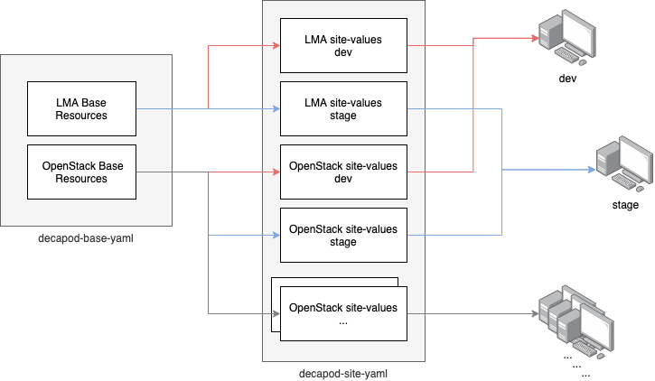

# Concept

## Background
There are tons of resources and helm charts to deploy in several environment (dev, stage, production...).  
Configuring YAML files according to the complex requirments takes a considerable amount of time and is easy to make a mistake.  
To improve this, `decapod-base-yaml` and `decapod-site-yaml` is designed to maintain base resources and site values seperately. 

## Decapod-yaml Design


## Default Layout
```yaml
 product # product name is a root directory.
 ├── base
 │   ├── kustomization.yaml
 │   ├── resources.yaml # All resources are defined with default values.
 │   └── site-values.yaml # patch of values overrided depending on environment.
 └── overlay_type_name # e.g. network, storage, plugin...
     └── overlay-values.yaml # patch of values
```


## How to write YAML
Suppose some assumptions:
- Here's a helm chart called `prometheus-operator`.
- Requirements:
  1. deploy chart in several environment(dev, stage, production).
  2. `nodeSelector` is set to `environment_name: 1`.
  3. `replicas` is flexible according to environment.  
   
_Original YAML file_:
```yaml
apiVersion: helm.fluxcd.io/v1
kind: HelmRelease
metadata:
  labels:
    name: prometheus-operator
  name: prometheus-operator
spec:
  chart:
    repository: https://prometheus-community.github.io/helm-charts
    name: prometheus-operator
    version: 9.3.2
  releaseName: prometheus-operator
  values:
    nodeSelector:
      kubernetes.io/hostname: localhost
    replicas: 2
```

_base/resources.yaml_:
```yaml
apiVersion: helm.fluxcd.io/v1
kind: HelmRelease
metadata:
  labels:
    name: prometheus-operator
  name: prometheus-operator
spec:
  chart:
    repository: https://prometheus-community.github.io/helm-charts
    name: prometheus-operator
    version: 9.3.2
  releaseName: prometheus-operator
  values:
    nodeSelector: {} # Set to empty map. Because key value is flexible.
    replicas: TO_BE_FIXED # Specify the value could be overrided  
```

_base/site-values.yaml_:
```yaml
apiVersion: openinfradev.github.com/v1
kind: HelmValuesTransformer
metadata:
  name: site

charts:
- name: prometheus-operator
  override:
    replicas: 1 # Override replicas
    nodeSelector:
      site_name: 1
```